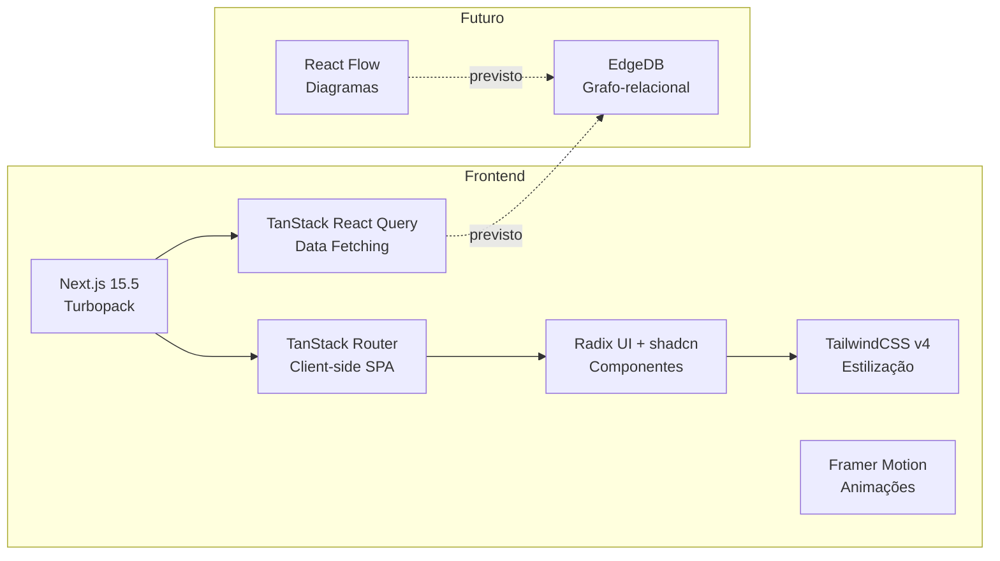
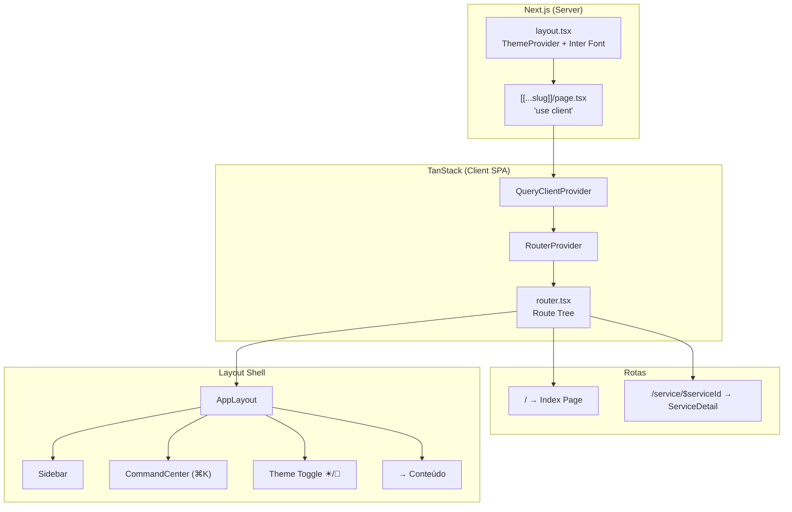
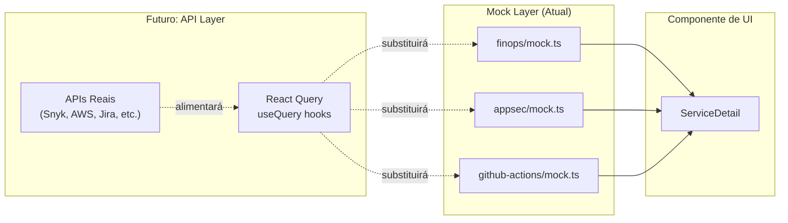
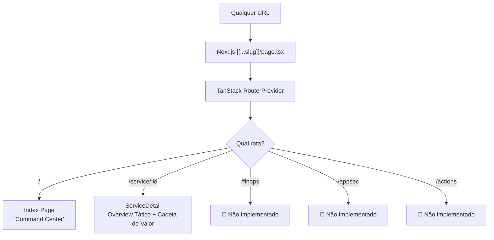
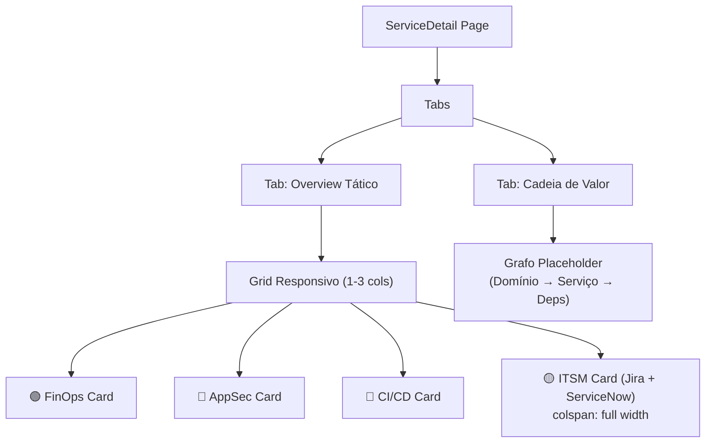
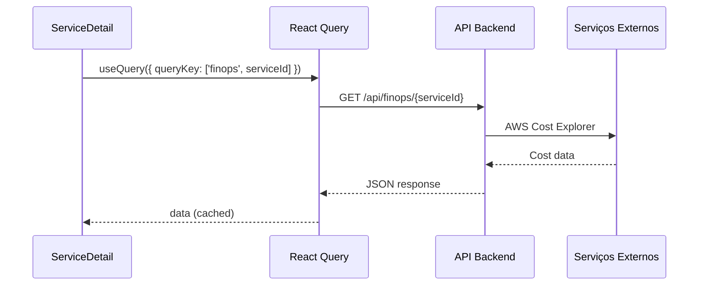

# 📘 HUB Consumer Finance — DeepWiki

> **Internal Developer Portal (IDP)** para centralizar métricas operacionais de engenharia, infraestrutura, custos e governança para squads de desenvolvimento do ecossistema de Finanças e Vendas.

---

## 📋 Índice

1. [Visão Geral](#1-visão-geral)
2. [Stack Tecnológica](#2-stack-tecnológica)
3. [Arquitetura do Sistema](#3-arquitetura-do-sistema)
4. [Estrutura de Diretórios](#4-estrutura-de-diretórios)
5. [Fluxo de Dados](#5-fluxo-de-dados)
6. [Roteamento (SPA Híbrida)](#6-roteamento-spa-híbrida)
7. [Camada de Layout e Navegação](#7-camada-de-layout-e-navegação)
8. [Sistema de Plugins (Domínios)](#8-sistema-de-plugins-domínios)
9. [Componentes UI (Design System)](#9-componentes-ui-design-system)
10. [Tema e Estilização](#10-tema-e-estilização)
11. [Camada de Dados (Mock → API)](#11-camada-de-dados-mock--api)
12. [Testes E2E](#12-testes-e2e)
13. [Estado Atual e Roadmap](#13-estado-atual-e-roadmap)
14. [Referência de Arquivos](#14-referência-de-arquivos)

---

## 1. Visão Geral

O **HUB Consumer Finance** é um *Command Center* que funciona como agregador tático para times de Produto e Engenharia. Ele centraliza dashboards de múltiplos domínios para oferecer visibilidade completa sobre cada microsserviço:

| Domínio | O que mostra |
|---|---|
| **FinOps** | Custos de cloud, projeções mensais, cloud waste |
| **AppSec** | Score de segurança, CVEs, conformidades (SOC2, PCI) |
| **CI/CD** | Histórico de pipelines do GitHub Actions |
| **ITSM** | Tickets do Jira (sprint ativo) + Incidentes ServiceNow |
| **Cadeia de Valor** | Grafo de dependências entre microsserviços |

> [!IMPORTANT]
> O projeto está em fase de **POC** (Proof of Concept). Todos os dados exibidos vêm de mocks estáticos, projetados para serem substituídos por integrações reais via React Query.

---

## 2. Stack Tecnológica



| Categoria | Tecnologia | Versão |
|---|---|---|
| Framework | Next.js | 15.5.12 |
| Runtime | React | 19.1.0 |
| Bundler | Turbopack | (embutido no Next.js) |
| Roteamento Client-Side | @tanstack/react-router | ^1.162.4 |
| Data Fetching | @tanstack/react-query | ^5.90.21 |
| Tabelas | @tanstack/react-table | ^8.21.3 |
| UI Primitives | Radix UI | ^1.4.3 |
| Component Kit | shadcn/ui | new-york style |
| Estilização | TailwindCSS | v4 |
| Animações | framer-motion | ^12.34.3 |
| Ícones | lucide-react | ^0.575.0 |
| Tema | next-themes | ^0.4.6 |
| i18n | i18next + react-i18next | ^25.8.13 / ^16.5.4 |
| Testes E2E | Playwright | ^1.58.2 |
| Banco de Dados (previsto) | EdgeDB | ^2.0.1 |
| Diagramas (previsto) | @xyflow/react | ^12.10.1 |

---

## 3. Arquitetura do Sistema

O projeto adota uma arquitetura de **SPA embutida em Next.js**, usando uma rota catch-all `[[...slug]]` para delegar todo o roteamento ao TanStack Router no client-side.



### Fluxo de Inicialização

1. **Next.js** serve o `RootLayout` que injeta `ThemeProvider` (dark mode padrão) e a fonte Inter
2. A rota catch-all `[[...slug]]/page.tsx` é marcada como `"use client"` e espera o mount do browser
3. Depois do mount, renderiza `QueryClientProvider` + `RouterProvider` do TanStack
4. O `router.tsx` define a árvore de rotas com `AppLayout` como root layout
5. `AppLayout` renderiza `Sidebar` + `CommandCenter` + `<Outlet />` (conteúdo dinâmico da rota)

---

## 4. Estrutura de Diretórios

```
hub-consumer-finance/
├── public/                     # Assets estáticos (SVGs)
├── src/
│   ├── app/                    # Next.js App Router
│   │   ├── [[...slug]]/
│   │   │   └── page.tsx        # ⚡ Catch-all SPA entry point
│   │   ├── globals.css         # 🎨 Design tokens + tema
│   │   ├── layout.tsx          # Root layout (ThemeProvider)
│   │   └── favicon.ico
│   ├── components/
│   │   ├── layout/
│   │   │   ├── app-layout.tsx  # 🏗️ Shell principal (Sidebar + Header + Outlet)
│   │   │   ├── sidebar.tsx     # 📱 Barra lateral com ícones
│   │   │   └── cmd-k.tsx       # 🔍 Command palette (⌘K)
│   │   ├── theme-provider.tsx  # 🌙 Wrapper do next-themes
│   │   └── ui/                 # 🧩 shadcn components (9 componentes)
│   │       ├── badge.tsx
│   │       ├── button.tsx
│   │       ├── card.tsx
│   │       ├── command.tsx
│   │       ├── dialog.tsx
│   │       ├── dropdown-menu.tsx
│   │       ├── progress.tsx
│   │       ├── table.tsx
│   │       ├── tabs.tsx
│   │       ├── toggle.tsx
│   │       └── tooltip.tsx
│   ├── lib/
│   │   └── utils.ts            # 🔧 cn() helper (clsx + tailwind-merge)
│   ├── plugins/                # 🔌 Domínios de negócio
│   │   ├── appsec/
│   │   │   └── mock.ts         # Mock de segurança (CVEs, compliance)
│   │   ├── finops/
│   │   │   ├── components/
│   │   │   │   └── service-detail.tsx  # 📊 Página principal de detalhe
│   │   │   └── mock.ts         # Mock de custos de cloud
│   │   └── github-actions/
│   │       └── mock.ts         # Mock de CI/CD, Jira, ServiceNow
│   └── router.tsx              # 🗺️ Árvore de rotas TanStack
├── tests/
│   └── example.spec.ts         # 🧪 Testes E2E (Playwright)
├── components.json             # Configuração shadcn/ui
├── next.config.ts              # Configuração Next.js (vazia)
├── package.json                # Dependências e scripts
├── playwright.config.ts        # Config Playwright (3 browsers)
├── tsconfig.json               # TypeScript (path aliases @/*)
└── KNOWLEDGE.md                # Knowledge base existente
```

---

## 5. Fluxo de Dados



### Dados Mockados Disponíveis

| Arquivo Mock | Exported Const | Dados |
|---|---|---|
| [finops/mock.ts](file:///Users/bardi/Projetos/POC%20HUB/hub-consumer-finance/src/plugins/finops/mock.ts) | `MOCK_FINOPS_COSTS` | Projeção mensal ($4850.20), waste ($320.50), 5 serviços com breakdown % |
| [appsec/mock.ts](file:///Users/bardi/Projetos/POC%20HUB/hub-consumer-finance/src/plugins/appsec/mock.ts) | `MOCK_SECURITY_SCORE` | Score "A-", 3 conformidades, 3 CVEs |
| [github-actions/mock.ts](file:///Users/bardi/Projetos/POC%20HUB/hub-consumer-finance/src/plugins/github-actions/mock.ts) | `MOCK_ACTIONS` | 5 pipeline runs |
| [github-actions/mock.ts](file:///Users/bardi/Projetos/POC%20HUB/hub-consumer-finance/src/plugins/github-actions/mock.ts) | `MOCK_JIRA` | 2 issues de sprint ativo |
| [github-actions/mock.ts](file:///Users/bardi/Projetos/POC%20HUB/hub-consumer-finance/src/plugins/github-actions/mock.ts) | `MOCK_SERVICENOW` | 2 incidentes abertos |

---

## 6. Roteamento (SPA Híbrida)

O roteamento usa uma abordagem **híbrida**: Next.js App Router com uma rota catch-all que delega tudo ao TanStack Router.



| Rota | Componente | Status |
|---|---|---|
| `/` | Index (inline) | ✅ Implementado |
| `/service/$serviceId` | `ServiceDetail` | ✅ Implementado |
| `/finops` | — | 🚧 Apenas link na sidebar |
| `/appsec` | — | 🚧 Apenas link na sidebar |
| `/actions` | — | 🚧 Apenas link na sidebar |

> [!NOTE]
> A sidebar exibe links para `/finops`, `/appsec` e `/actions`, mas essas rotas **ainda não foram definidas** no `router.tsx`. Acessá-las resultará em erro 404 do TanStack Router.

---

## 7. Camada de Layout e Navegação

### AppLayout ([app-layout.tsx](file:///Users/bardi/Projetos/POC%20HUB/hub-consumer-finance/src/components/layout/app-layout.tsx))

Shell principal da aplicação com 3 áreas:

```
┌────────┬──────────────────────────────────────────┐
│        │  Header (glass-panel, sticky)            │
│        │  ┌──────────────┐  HUB Consumer Finance  │
│Sidebar │  │ ⌘K Search    │         ☀/🌙           │
│ (64px) │  └──────────────┘                        │
│        ├──────────────────────────────────────────┤
│  🏠    │                                          │
│  💻    │        <Outlet />                        │
│  💰    │     (Conteúdo da Rota)                   │
│  🛡    │                                          │
│  🔀    │                                          │
│        │                                          │
└────────┴──────────────────────────────────────────┘
```

### Sidebar ([sidebar.tsx](file:///Users/bardi/Projetos/POC%20HUB/hub-consumer-finance/src/components/layout/sidebar.tsx))

- Barra vertical de **64px** com ícones
- Logo circular no topo com glow neon
- 5 links de navegação com indicador ativo (barra lateral verde neon)
- Efeito hover com transição suave

### Command Palette ([cmd-k.tsx](file:///Users/bardi/Projetos/POC%20HUB/hub-consumer-finance/src/components/layout/cmd-k.tsx))

- Atalho **⌘K** (ou clique no botão de busca)
- Busca rápida por **Serviços** e **Incidentes**
- Navega diretamente para o detalhe do serviço ao selecionar
- Usa componentes `cmdk` (Command primitives)

---

## 8. Sistema de Plugins (Domínios)

O coração da aplicação é a página [service-detail.tsx](file:///Users/bardi/Projetos/POC%20HUB/hub-consumer-finance/src/plugins/finops/components/service-detail.tsx) que agrega todos os domínios em um **Overview Tático** com abas.



### 8.1 FinOps Card — Cloud Costs & Waste

Exibe métricas financeiras de cloud:
- **Projeção do Mês**: valor total estimado
- **Cloud Waste**: recursos ociosos identificados
- **Breakdown**: top 3 serviços com barra de progresso (EKS, RDS, ElastiCache)

### 8.2 AppSec Card — Security Scorecard

Dashboard de segurança:
- **Score visual**: círculo com nota (ex: "A-") com glow neon rosa
- **Conformidades**: badges de SOC2, ISO27001, PCI-DSS
- **CVEs ativas**: lista de vulnerabilidades com severidade colorizada

### 8.3 CI/CD Card — GitHub Actions

Histórico de pipeline com:
- Status (dot verde/vermelho com glow neon)
- Workflow name, branch, commit hash
- Tempo de execução
- Botão de **Re-run** para falhas

### 8.4 ITSM Card — Jira & ServiceNow (Full Width)

Dividido em duas colunas:

| Jira — Sprint Ativo | ServiceNow — Incidentes |
|---|---|
| Issue keys (BIL-3420) | Incident IDs (INC0012042) |
| Tipo (Story/Bug) | Prioridade (P2/P3) |
| Status (In Progress/To Do) | Estado (New/In Progress) |

### 8.5 Cadeia de Valor (Tab Separada)

- Placeholder visual com boxes conectados simulando um grafo
- Mostra: `Domínio: Vendas` → `core-billing` → `Payment Gateway`
- Nota explicativa sobre futura integração com React Flow + EdgeDB

---

## 9. Componentes UI (Design System)

Baseado no **shadcn/ui** (estilo `new-york`) com 9 componentes instalados:

| Componente | Uso na aplicação |
|---|---|
| **Badge** | Tags de squad, domínio, severidade, status |
| **Button** | Ações (Sync Data, Open Repo, Re-run, Theme Toggle) |
| **Card** | Container principal para cada domínio |
| **Command** | Paleta de comandos (⌘K) |
| **Dialog** | Modal da paleta de comandos |
| **Dropdown Menu** | (disponível, não usado atualmente) |
| **Progress** | Barras de custo no FinOps |
| **Table** | (disponível, não usado atualmente) |
| **Tabs** | Overview Tático / Cadeia de Valor |
| **Toggle** | (disponível, não usado atualmente) |
| **Tooltip** | (importado no sidebar, pode não estar ativo) |

Cada componente utiliza o helper `cn()` de [utils.ts](file:///Users/bardi/Projetos/POC%20HUB/hub-consumer-finance/src/lib/utils.ts) que combina `clsx` + `tailwind-merge` para composição segura de classes.

---

## 10. Tema e Estilização

### Design Tokens ([globals.css](file:///Users/bardi/Projetos/POC%20HUB/hub-consumer-finance/src/app/globals.css))

O tema segue uma paleta **"Midnight Deep Blue + Neon Accents"**:

| Token | Light | Dark | Uso |
|---|---|---|---|
| `--background` | `oklch(0.98, 0, 0)` branco | `oklch(0.15, 0.02, 260)` azul profundo | Fundo da app |
| `--primary` | `oklch(0.2, 0.05, 250)` | `oklch(0.65, 0.15, 250)` neon blue | Botões, links, destaques |
| `--destructive` | `oklch(0.57, 0.22, 27)` | `oklch(0.5, 0.2, 27)` neon rose | Vulnerabilidades, erros |

### Cores de Acento Neon

```css
--color-neon-emerld:  #10B981   /* Indicadores "healthy", custos ok */
--color-neon-amber:   #F59E0B   /* Alertas de waste, cloud warnings */
--color-neon-rose:    #E11D48   /* Vulnerabilidades, falhas de CI */
```

### Glassmorphism

A classe utilitária `.glass-panel` aplica o efeito de vidro translúcido:
```css
.glass-panel {
    @apply bg-white/5 border border-white/10 backdrop-blur-md
           dark:bg-black/20 dark:border-white/5;
}
```

Usado no header, sidebar e nos cards de domínio para criar profundidade visual.

### Efeitos Neon (Shadow Glow)

Vários elementos usam `box-shadow` com brilho neon:
```css
shadow-[0_0_15px_rgba(16,185,129,0.5)]   /* Emerald glow (logo, botões) */
shadow-[0_0_10px_rgba(16,185,129,0.3)]   /* Emerald sutil (nav ativa) */
shadow-[0_0_15px_rgba(225,29,72,0.2)]    /* Rose glow (score de segurança) */
shadow-[0_0_8px_rgba(225,29,72,0.8)]     /* Rose forte (falha de CI) */
```

---

## 11. Camada de Dados (Mock → API)

### Estratégia Atual

Todos os dados são **importados diretamente** dos arquivos `mock.ts` de cada plugin como constantes estáticas. Não há chamadas assíncronas nem React Query hooks em uso.

```typescript
// service-detail.tsx — importações diretas
import { MOCK_FINOPS_COSTS } from "@/plugins/finops/mock";
import { MOCK_SECURITY_SCORE } from "@/plugins/appsec/mock";
import { MOCK_ACTIONS, MOCK_JIRA, MOCK_SERVICENOW } from "@/plugins/github-actions/mock";
```

### Estratégia Futura (Prevista)



A infraestrutura do React Query (`QueryClientProvider`) já está montada no [page.tsx](file:///Users/bardi/Projetos/POC%20HUB/hub-consumer-finance/src/app/%5B%5B...slug%5D%5D/page.tsx), pronta para receber hooks `useQuery` quando as APIs reais forem implementadas.

---

## 12. Testes E2E

O projeto usa **Playwright** com testes em 3 browsers (Chromium, Firefox, WebKit).

### Suites de Teste ([example.spec.ts](file:///Users/bardi/Projetos/POC%20HUB/hub-consumer-finance/tests/example.spec.ts))

| Suite | Testes | O que valida |
|---|---|---|
| **Command Center** | 3 | Home page, sidebar, navegação para service detail |
| **Overview Tático** | 4 | Cards de FinOps, AppSec, CI/CD, ITSM |
| **Cadeia de Valor** | 2 | Troca de tab, placeholder React Flow |
| **Command Palette** | 3 | Abertura, fechamento, listagem de serviços/incidentes |
| **Theme Toggle** | 1 | Existência e clique do botão de tema |
| **Total** | **13 testes** | |

### Comandos

```bash
npm run test:e2e        # Roda todos os testes headless
npm run test:e2e:ui     # Abre a UI interativa do Playwright
```

### Configuração

- Base URL: `http://localhost:3000`
- Dev server automático: `npm run dev` (com timeout de 120s)
- Screenshots: apenas em falhas
- Traces: na primeira retry

---

## 13. Estado Atual e Roadmap

### ✅ Implementado

- [x] Estrutura SPA com Next.js + TanStack Router
- [x] Layout shell (Sidebar + Header + Outlet)
- [x] Command palette (⌘K) com navegação
- [x] Página de detalhe do serviço com 4 cards de domínio
- [x] Tema dark/light com glassmorphism
- [x] Dados mockados para todos os domínios
- [x] 13 testes E2E com Playwright
- [x] Design system baseado em shadcn/ui (9 componentes)
- [x] Suporte a i18n (dependência instalada, uso inline mínimo)

### 🚧 Parcialmente Implementado

- [ ] Cadeia de Valor: apenas placeholder estático (React Flow e EdgeDB estão como dependências mas não são usados)
- [ ] i18n: `i18next` instalado mas tradução é feita com dict inline na `service-detail.tsx`
- [ ] Rotas `/finops`, `/appsec`, `/actions`: links existem na sidebar mas as rotas não estão definidas

### 🔮 Planejado (Não Iniciado)

- [ ] Substituir mocks por integrações reais via React Query
- [ ] Backend API para aggregação de dados
- [ ] EdgeDB para modelagem grafo-relacional de times e serviços
- [ ] React Flow para visualização interativa da cadeia de valor
- [ ] Páginas dedicadas por domínio (FinOps Explorer, AppSec Dashboard, CI/CD Hub)
- [ ] Busca real no Command Palette (atualmente é estático)

---

## 14. Referência de Arquivos

| Arquivo | Linhas | Responsabilidade |
|---|---|---|
| [page.tsx](file:///Users/bardi/Projetos/POC%20HUB/hub-consumer-finance/src/app/%5B%5B...slug%5D%5D/page.tsx) | 31 | Entry point SPA — monta QueryClient + RouterProvider |
| [layout.tsx](file:///Users/bardi/Projetos/POC%20HUB/hub-consumer-finance/src/app/layout.tsx) | 33 | Root layout — ThemeProvider + Inter font |
| [globals.css](file:///Users/bardi/Projetos/POC%20HUB/hub-consumer-finance/src/app/globals.css) | 90 | Design tokens, tema light/dark, classe `.glass-panel` |
| [router.tsx](file:///Users/bardi/Projetos/POC%20HUB/hub-consumer-finance/src/router.tsx) | 38 | Árvore de rotas TanStack (2 rotas ativas) |
| [app-layout.tsx](file:///Users/bardi/Projetos/POC%20HUB/hub-consumer-finance/src/components/layout/app-layout.tsx) | 40 | Shell da app (Sidebar + Header + Outlet) |
| [sidebar.tsx](file:///Users/bardi/Projetos/POC%20HUB/hub-consumer-finance/src/components/layout/sidebar.tsx) | 51 | Navegação lateral com 5 links e indicador ativo |
| [cmd-k.tsx](file:///Users/bardi/Projetos/POC%20HUB/hub-consumer-finance/src/components/layout/cmd-k.tsx) | 72 | Paleta de comandos ⌘K |
| [service-detail.tsx](file:///Users/bardi/Projetos/POC%20HUB/hub-consumer-finance/src/plugins/finops/components/service-detail.tsx) | 290 | Página principal — agrega todos os 4 cards de domínio |
| [finops/mock.ts](file:///Users/bardi/Projetos/POC%20HUB/hub-consumer-finance/src/plugins/finops/mock.ts) | 13 | Mock de custos de cloud (5 serviços AWS) |
| [appsec/mock.ts](file:///Users/bardi/Projetos/POC%20HUB/hub-consumer-finance/src/plugins/appsec/mock.ts) | 10 | Mock de segurança (score, CVEs, compliance) |
| [github-actions/mock.ts](file:///Users/bardi/Projetos/POC%20HUB/hub-consumer-finance/src/plugins/github-actions/mock.ts) | 18 | Mock de CI/CD, Jira e ServiceNow |
| [utils.ts](file:///Users/bardi/Projetos/POC%20HUB/hub-consumer-finance/src/lib/utils.ts) | 7 | Helper `cn()` para merge de classes Tailwind |
| [theme-provider.tsx](file:///Users/bardi/Projetos/POC%20HUB/hub-consumer-finance/src/components/theme-provider.tsx) | 13 | Wrapper para next-themes |
| [example.spec.ts](file:///Users/bardi/Projetos/POC%20HUB/hub-consumer-finance/tests/example.spec.ts) | 162 | 13 testes E2E (Playwright) |
